# Extracurricular Assignment 01: Cybersecurity CTF

## Overview
This repository contains the deliverable for Extracurricular Assignment 01 (EA-1). The chosen activity was participating in **picoCTF**, a cybersecurity Capture The Flag platform. 

Specifically, this repository documents the analysis and solution for three challenges: **Riddle Registry** (Digital Forensics), **Log Hunt** (General Skills), and **Hidden in plainsight** (Forensics / Steganography).

## Deliverable Information
* **Activity:** picoCTF
* **Challenge 1:** Riddle Registry (Forensics)
    * **Objective:** Extract a hidden, encoded flag from a provided PDF document (confidential.pdf).
* **Challenge 2:** Log Hunt (General Skills)
    * **Objective:** Reconstruct a secret flag from scattered fragments leaked inside a server log file.
* **Challenge 3:** Hidden in plainsight (Forensics / Steganography)
    * **Objective:** Discover a hidden payload tucked away inside a seemingly ordinary JPG image and extract the flag.

## Repository Contents
* challenges/riddle-registry/: Contains the target PDF file and a detailed solution-notes.md write-up.
* challenges/log-hunt/: Contains the target server log file and a detailed solution-notes.md write-up.
* challenges/hidden-in-plainsight/: Contains the target JPG file, the extracted flag.txt, and a detailed solution-notes.md write-up.
* assets/: Contains proof of participation and successful completion screenshots for all challenges.
* Reflection.md: A critical reflection on the activity, technical decisions, and connections to computer science concepts.

## Instructions to Reproduce
To view the technical solution process:

### Riddle Registry
1. Navigate to the challenges/riddle-registry/ directory.
2. Review the solution-notes.md file for the exact command-line workflow (exiftool, strings, grep, base64) used to extract and decode the hidden flag from the raw binary data.

### Log Hunt
1. Navigate to the challenges/log-hunt/ directory.
2. Review the solution-notes.md file for the command-line workflow (grep) used to parse the server log and reconstruct the flag fragments.

### Hidden in plainsight
1. Navigate to the challenges/hidden-in-plainsight/ directory.
2. Review the solution-notes.md file for the command-line workflow (binwalk, exiftool, base64, steghide) used to discover the hidden payload, decode the extraction password, and extract the final text file from the image.

---

## Proof of Participation

### Activity Registration
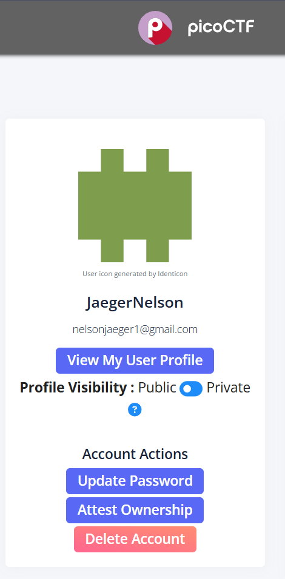

### Challenge 1: Riddle Registry
Below is the evidence of successful participation and completion of the Riddle Registry challenge:

**1. Problem Description:**
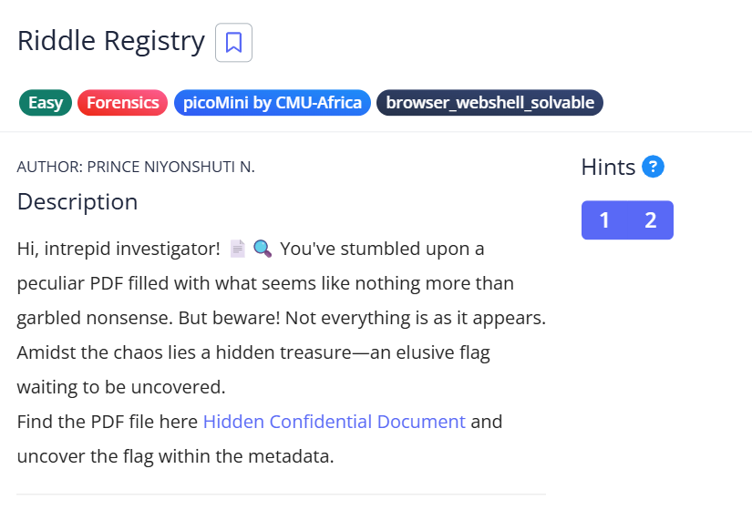

**2. Locating the Encoded String:**
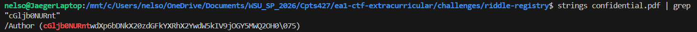

**3. Decoding the Final Flag:**
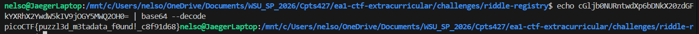

**4. Challenge Solved:**
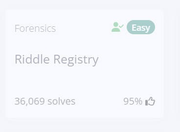

### Challenge 2: Log Hunt
Below is the evidence of successful participation and completion of the Log Hunt challenge:

**1. Problem Description:**
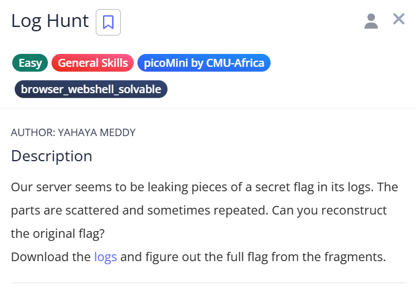

**2. Reconstructing the Flag from Log Fragments:**
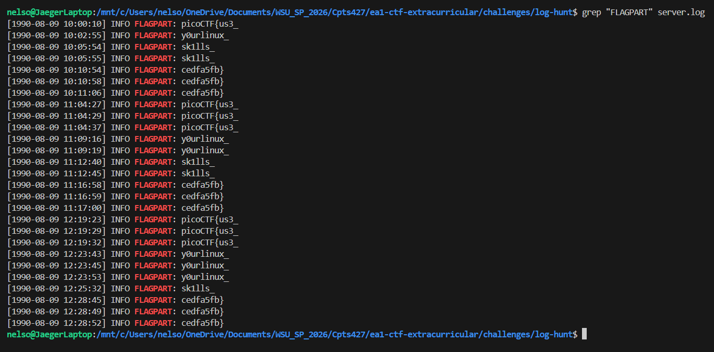

**3. Challenge Solved:**
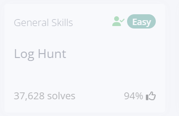

### Challenge 3: Hidden in plainsight
Below is the evidence of successful participation and completion of the Hidden in plainsight challenge:

**1. Problem Description:**
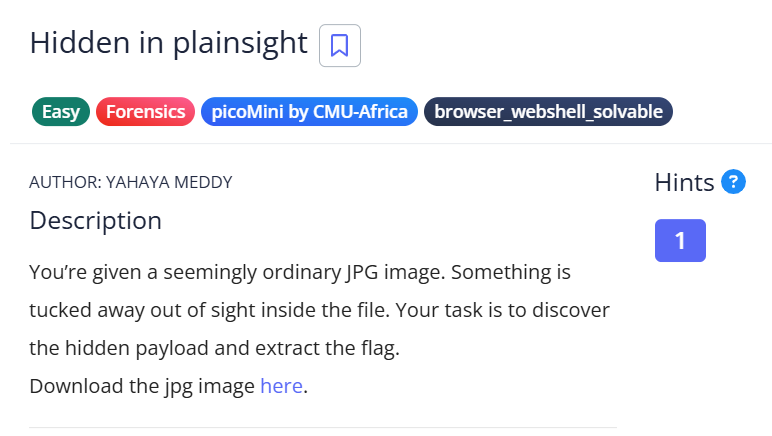

**2. Finding the Secret Comment:**
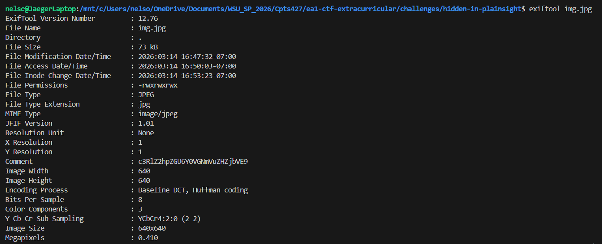

**3. Decrypting the Password and Extracting Data:**
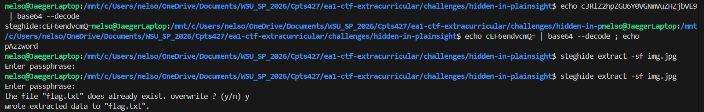

**4. Viewing the Extracted Flag:**
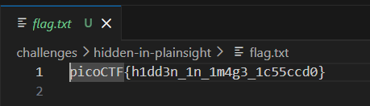

**5. Challenge Solved:**
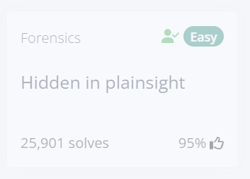

---

## Reflection Report
Please review the [Reflection.md](./Reflection.md) file in the root directory for a detailed analysis of the technical approach, individual contributions, and a quality assessment of the experience.